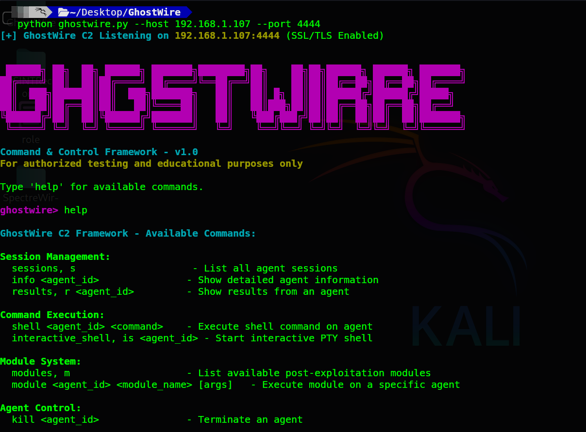

# GhostWire C2 Framework

  

> on target machine : python3 agent.py 


---
> **A modular, multi-session, and encrypted Command & Control (C2) framework built for learning and red team operations.**  
> `#C2Framework` `#GhostWire` `#RedTeamTooling` `#OffensiveSecurity`

I just built this C2 for learning purposes and to get an idea of how C2 frameworks like Cobalt Strike, Havoc, and Villain work. It is intended as an educational tool to explore the core concepts of offensive infrastructure.

---

## Features

-   **Encrypted Communication:** All communication between the agent and the C2 server is wrapped in an outer SSL/TLS layer and an inner AES-256-GCM authenticated encryption layer, ensuring confidentiality and integrity.
-   **Dynamic Python Agent:** The agent is a cross-platform Python script. Payloads are generated on-the-fly, embedding the necessary configuration for immediate connection.
-   **Full Session Management:** The C2 server tracks all active and offline agents, allowing the operator to interact with specific sessions.
-   **Connection Multiplexing:** A single listener port handles both asynchronous agent beacons and fully interactive PTY shell connections.
-   **Modular Architecture:** Easily extend functionality by dropping new post-exploitation modules (Python classes) into the `modules/` directory.
-   **Dual-Shell System:**
    -   **Simple Shell:** Fire-and-forget command execution for quick tasks (`shell <id> whoami`).
    -   **Interactive Shell:** A full, pseudo-terminal (PTY) shell for an immersive experience on Linux & macOS targets (`interactive_shell <id>`).

---
## How It Works

The GhostWire framework operates on a simple yet effective client-server model designed for stealth and flexibility.

1.  **C2 Server:** The core server listens on a single SSL/TLS port. It manages agent sessions, parses operator commands, and queues tasks for agents. It uses a connection multiplexer to intelligently route incoming traffic to either the beacon handler or the interactive shell handler.
2.  **Payload Generator:** Before deployment, the operator uses the `payload_generator.py` script. This script reads the C2's IP, port, and the pre-shared AES encryption key from `server_state.json` and embeds them into a Python agent template (`agent_template.py`).
3.  **Agent Execution:** Once the generated payload is executed on a target, it starts its main beaconing loop. In each beacon, it sends any collected results (e.g., command output) and polls the C2 for new tasks. All of this is encrypted with the baked-in AES key.Agents can be compiled for different platforms for ease use.
4.  **Tasking:** The operator tasks an agent via the C2 console. The task is queued on the server and delivered to the agent during its next check-in. The agent executes the task (e.g., runs a command, executes a module) and sends the output back in the next beacon.

---
### Architecture Diagram

```text
┌──────────────────────────────┐                ┌────────────────────────────┐
│          Operator            │                │      GhostWire C2 Server   │
│   (Interactive CLI Prompt)   │  localhost     │   (Python, SSL/TLS Port)   │
└──────────────┬───────────────┘      ▲         └──────────────┬─────────────┘
               │                      │                          │
               │ Commands             │ SSL + AES-GCM Encrypted  │
               │ (e.g., shell, module)│        Channel           │
               ▼                      │                          │
        ┌──────────────┐              │                          │
        │ Task Queue & │              │                          │
        │ Session Mgr  │◀─────────────┤                          │
        │ (In-Memory)  │              │                          │
        └──────────────┘              │                          │
                                      │                          │
                                      │                          │
                                      │                          │
┌──────────────────────────────┐      │                          │
│        Target System         │      │                          │
│ ┌──────────────────────────┐ │      │                          │
│ │   GhostWire Agent (py)   │ │◄───────────────────────────────┘
│ │ - Beacon Loop            │ │      Beacon/Poll for Tasks
│ │ - Task Processor         │ │
│ └──────────────────────────┘ │
└──────────────────────────────┘
```

---
## A Note on Development and Intended Use

It's crucial to understand that GhostWire was born from a desire to learn. I built this framework as an educational project to deconstruct and experiment with the core mechanics of modern C2s like Cobalt Strike and Havoc. Its primary purpose is to serve as a hands-on tool for research and for demonstrating C2 concepts.

While it implements functional C2 capabilities, **this is not a tool hardened for real-world red team engagements.** It is still in an early development stage and should be treated as a work-in-progress.

---
## Quick Start

### 1. Server Setup

First, clone the repository and install the required dependencies.

```bash
# Clone the repository
git clone https://github.com/KaulikMakwana/GhostWire.git
cd GhostWire

# Install dependencies
pip install -r requirements.txt
```

Run the C2 server. A self-signed SSL certificate will be generated automatically if one is not found.

```bash
# Run the server on default port 443
# Replace YOUR_IP with your actual server IP for the agent to connect back to . also you can choose port also for your choice.
python3 ghostwire.py --host 192.168.1.102 --port 443
```

### 2. Payload Generation

In a separate terminal, generate the agent payload. The generator will automatically pull the necessary connection details from the running server.

```bash
# Generate a payload for Linux/macOS
python3 payload_generator.py --type lin -o lin-agent.py

# Or generate a payload for Windows (console-less)
python3 payload_generator.py --type win -o win-agent.pyw
```

The new payload will be located in the `payloads/` directory.

### 3. Deployment

Transfer the generated payload to your target machine and execute it.
You can also compile into binary executable and transfer to target.

```bash
# On the target machine
python3 agent.py OR ./agent.exe OR ./agent
```

You will see a `[+] New Agent Check-in` message on your C2 server console.

## Operator Commands


## Directory Layout

```
GhostWire/
├── core/
│   ├── agent_template.py     # Base template for the agent
│   └── c2_server.py          # Core server logic, session management, and CLI
├── modules/
│   ├── creds.py              # Example credential harvesting module
│   └── ...                   # Drop other custom modules here
├── payloads/
│   └── ...                   # Generated payloads will appear here
├── ghostwire.py              # Main C2 server entrypoint
├── payload_generator.py      # Script to create agent payloads
├── requirements.txt          # Python dependencies
├── cert.pem                  # Auto-generated SSL certificate
├── key.pem                   # Auto-generated SSL private key
└── README.md
```

## Extending with Modules

Creating a new module is straightforward:

1.  Create a new Python file in the `/modules` directory (e.g., `modules/sysinfo.py`).
2.  Inside the file, define a class with a unique name (e.g., `Sysinfo`).
3.  Add a `"""Docstring"""` to the class to describe its purpose. This will be shown in the `modules` command.
4.  Implement a static method `run_remote(args)` that contains your module's logic. This method must capture and `return` all of its output as a single string.

---

## Disclaimer

GhostWire is intended for authorized red-teaming, penetration testing, and legitimate cybersecurity research only. The authors assume no liability and are not responsible for any misuse or damage caused by this program.
